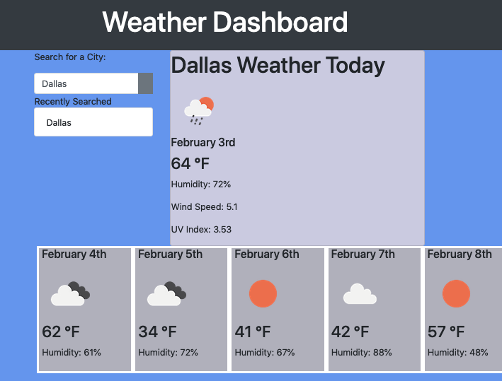

# Homework 6 : Creating a Weather Dashboard 

This is the homework for the 06 Server Side APIs unit.  

This project uses Bootstrap, JQuery, the Moment.js library, and the [OpenWeatherMap.org] API. 

* Files Included in this project
    * index.html
    * style.css
    * script.js
    * README 
    * assets

# The Project

As a traveler  

I want to see the weather outlook for multiple cities  

so that I can plan a trip accordingly  

# How to use this Weather Dashboard

* Load in browser while connected to the internet  
* Input the name of the city that you would like to retrieve weather data on
* The weather data that is currently going on in the city you searched will be displayed
* A five day forecast of upcoming expected weather will also be displayed

## Link to live Weather Dashboard can be viewed [here](https://gabymag.github.io/H6-WeatherDash/)

